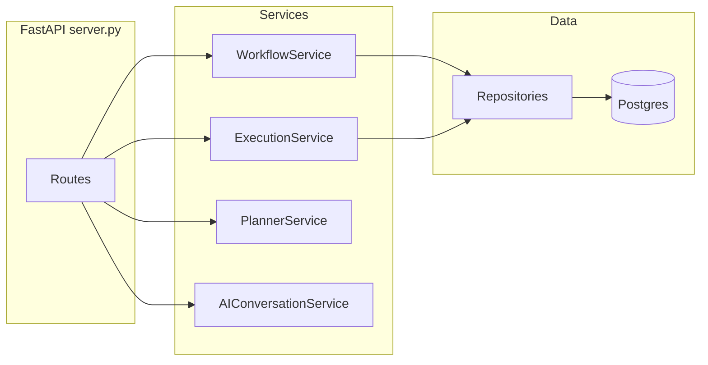

# work-flow 项目详解

本文档说明 `lumina/work-flow` 仓库的整体架构、目录职责，以及与同目录下「智能舆情」主应用 **Lumina** 的关系。若你只关心如何把 Lumina 接上工作流能力，请直接阅读同目录下的 [Lumina 与工作流前端对接指南.md](./Lumina与工作流前端对接指南.md)。

---

## 1. 总览

- **本仓库（work-flow）**：包含基于 **LangGraph** 的工作流引擎（Python）、对外 **FastAPI** 服务，以及一个独立的 **工作流可视化前端**（`workflow_engine/frontend`）。
- **Lumina 主前端**：位于上级目录 `lumina/`（与 `work-flow` 平级），是步骤向导式舆情分析 UI（Vite 开发端口通常为 **3000**）。它与工作流前端是 **两个独立的单页应用**，可并行开发；对接时通过 **同一套 HTTP API**、链接跳转或代码合并等方式衔接。

**重要约定（与部分旧文档不一致时，以此为准）**

- **HTTP API 路径**：一律以工作流前端源码 [`workflow_engine/frontend/src/api/workflowApi.ts`](../workflow_engine/frontend/src/api/workflowApi.ts) 中的路径为准，前缀均为 **`/api/v1/...`**。[`前端接入.md`](../workflow_engine/frontend/前端接入.md) 中部分示例使用 `/api/workflows`（缺少 `v1`），请勿照抄。
- **响应格式**：[`docs/API_SPECIFICATION.md`](../workflow_engine/frontend/docs/API_SPECIFICATION.md) 中描述的 `{ code, message, data }` 包装，与当前 FastAPI 多数接口的 **扁平 JSON** 可能不一致；联调时请以浏览器网络面板或 `/docs` 中的实际响应为准。
- **后端监听端口**：`api/server.py` 内 `start()` 使用 **8123**；而 `scripts/start_services.sh`、工作流前端 Vite 代理与 `.env` 默认指向 **8000**。启动方式不同会导致端口不同，对接前必须统一（详见对接指南）。

---

## 2. 工作流 JSON 协议

- 完整字段说明见仓库根目录 [**工作流标准格式.md**](../工作流标准格式.md)。
- 核心结构为 **`WorkflowDefinition`**：`name`、`description`（可选）、`variables`（可选）、`nodes[]`、`edges[]`。
- 节点含 `id`、`type`（如 `Start`、`End`、`LLM`、`Code`、`Condition`、`Loop` 及业务 Agent 类型等）、`config`（含 `title`、`params` 等）。
- 该格式是：**Planner 生成**、**数据库存储**、**执行引擎** 与 **React Flow 画布** 之间的共同契约。前端 [`src/mappers/workflowGraph.ts`](../workflow_engine/frontend/src/mappers/workflowGraph.ts) 负责图数据与 `WorkflowDefinition` 的双向转换。

---

## 3. 后端架构

### 3.1 两个入口，不要混淆

| 入口 | 文件 | 作用 |
|------|------|------|
| CLI | [`workflow_engine/main.py`](../workflow_engine/main.py) | 读取 JSON 或 `--plan` 意图，构建 LangGraph 并 **在进程内执行**；不提供 HTTP。 |
| HTTP API | [`workflow_engine/api/server.py`](../workflow_engine/api/server.py) | FastAPI 应用：生成/保存/执行工作流、对话、执行记录查询等。 |

### 3.2 分层（API → Service → Repository → DB）



- **`workflow_engine/src/services/`**：工作流 CRUD、执行编排、Planner 封装、对话与 AI 会话等。
- **`workflow_engine/src/core/`**：DSL 与图构建（如 `GraphBuilder`）。
- **`workflow_engine/src/nodes/`**：各类节点实现（LLM、Code、Condition、Loop、各 Agent 节点等）。
- **`workflow_engine/src/planner/`**：从自然语言生成工作流 JSON。
- **`workflow_engine/src/agents/`**：舆情等业务向 Agent 实现。
- **`workflow_engine/src/monitoring/`**：执行过程监控与报告。
- **`workflow_engine/src/database/`**：模型、连接、各 Repository。

### 3.3 API 路由分组（便于查阅 `server.py`）

- **健康与根路径**：`GET /`、`GET /health`
- **生成**：`POST /api/v1/workflows/generate`、`POST /api/v1/workflows/generate-public-opinion`
- **执行与记录**：`POST /api/v1/workflows/execute`，`GET /api/v1/executions/{id}`，`GET /api/v1/workflows/{id}/executions`，`GET /api/v1/executions/{id}/report`
- **工作流 CRUD**：`GET/POST /api/v1/workflows`，`GET/PUT/DELETE /api/v1/workflows/{workflow_id}`
- **对话**：`POST /api/v1/conversations/start`、`POST /api/v1/conversations/continue`，以及历史与改进相关 GET 接口
- **智能体模板**：`GET /api/v1/agents/templates`

完整契约以 OpenAPI 为准：启动 API 后访问 **`/docs`**。

---

## 4. 工作流前端 `workflow_engine/frontend`

### 4.1 技术栈

- React 19、TypeScript、Vite 5
- 画布：**@xyflow/react**（React Flow）
- 状态：**Zustand**（[`src/store/workflowStore.ts`](../workflow_engine/frontend/src/store/workflowStore.ts)）
- 服务端状态：**@tanstack/react-query**（[`src/api/workflowHooks.ts`](../workflow_engine/frontend/src/api/workflowHooks.ts)）
- UI：Radix、Tailwind、Lucide；编辑器：Monaco；图表：Recharts  

（与 [`frontend/package.json`](../workflow_engine/frontend/package.json) 一致。）

### 4.2 目录职责

| 路径 | 说明 |
|------|------|
| `src/api/workflowApi.ts` | 所有 REST 调用的 **唯一权威路径列表** |
| `src/api/workflowHooks.ts` | React Query 的 `useQuery` / `useMutation` 封装 |
| `src/store/workflowStore.ts` | 当前工作流、对话消息、执行状态、节点选中态等 |
| `src/mappers/workflowGraph.ts` | 画布图 ↔ `WorkflowDefinition` |
| `src/utils/normalize.ts` | 执行接口响应归一化（兼容多种后端字段形状） |
| `src/types/workflow.ts` | TypeScript 类型 |
| `src/components/layout/` | `TopBar`、`CanvasPanel`、`ChatPanel`、`RightDrawer`、`BottomPanel` 主界面骨架 |
| `src/features/execution/stats.ts` | 执行统计展示辅助 |
| `src/App.tsx` | 组合布局、对话、保存、执行与轮询逻辑 |

### 4.3 运行时数据流（简图）

```mermaid
sequenceDiagram
  participant UI as App.tsx
  participant API as workflowApi.ts
  participant BE as FastAPI
  UI->>API startConversation_or_continue
  API->>BE POST /api/v1/conversations/...
  BE-->>API workflow and message
  UI->>API executeWorkflow
  API->>BE POST /api/v1/workflows/execute
  BE-->>API execution_id
  loop polling
    UI->>API getExecutionDetail
    API->>BE GET /api/v1/executions/id
  end
```

开发时默认 **`npm run dev`** → 常见端口 **5173**；`vite.config.ts` 将 `/api` 代理到后端（默认目标见该文件，当前为 **8000**）。

---

## 5. 仓库其他部分

| 路径 | 说明 |
|------|------|
| [`work-flow/package.json`](../package.json) | 根目录仅 **Playwright** E2E 测试脚本，不是工作流前端入口 |
| [`workflow_engine/test/`](../workflow_engine/test/) | Python 单元/集成测试 |
| [`workflow_engine/scripts/`](../workflow_engine/scripts/) | 如 `start_services.sh`：起后端（默认端口 8000）等 |
| [`workflow_engine/data/`](../workflow_engine/data/) | 示例工作流 JSON |

---

## 6. 已有文档索引（本仓库内）

| 文档 | 适用场景 |
|------|----------|
| [`workflow_engine/README.md`](../workflow_engine/README.md) | 引擎能力、环境变量、CLI 与 API 快速开始 |
| [`workflow_engine/frontend/README.md`](../workflow_engine/frontend/README.md) | 前端技术栈、目录结构、代理与环境变量说明 |
| [`workflow_engine/frontend/前端接入.md`](../workflow_engine/frontend/前端接入.md) | 把画布/组件嵌入其他应用的思路与示例（注意 API 路径需改为 `v1`） |
| [`workflow_engine/frontend/docs/API_SPECIFICATION.md`](../workflow_engine/frontend/docs/API_SPECIFICATION.md) | 接口语义与示例体（响应包装可能与实现不一致，以实机为准） |
| [`workflow_engine/frontend/docs/CONFIGURATION.md`](../workflow_engine/frontend/docs/CONFIGURATION.md) | Vite、环境变量、代理等细化说明 |
| **本文档 + [对接指南](./Lumina与工作流前端对接指南.md)** | 与上级 Lumina 项目联调时的架构与步骤 |

---

## 7. 附录：环境与启动顺序（摘要）

1. Python 3.10+，`pip install -r workflow_engine/requirements.txt`
2. 在 `workflow_engine` 下配置 `.env`：至少 **LLM**（如 `OPENAI_API_KEY` / DeepSeek 等，见 [`workflow_engine/.env.example`](../workflow_engine/.env.example)）；若使用持久化，配置 **`DATABASE_URL`**（PostgreSQL），并按团队文档执行初始化脚本（如 `scripts/init_postgres.py`）。
3. 启动 API：推荐与前端代理一致，例如  
   `python -m uvicorn api.server:app --host 0.0.0.0 --port 8000`（在 `workflow_engine` 目录下，且需保证 Python 路径能解析 `workflow_engine` 包；具体以团队 README 为准）。
4. 启动工作流前端：进入 `workflow_engine/frontend`，`npm install && npm run dev`。

更多细节以 [`workflow_engine/README.md`](../workflow_engine/README.md) 为准。
